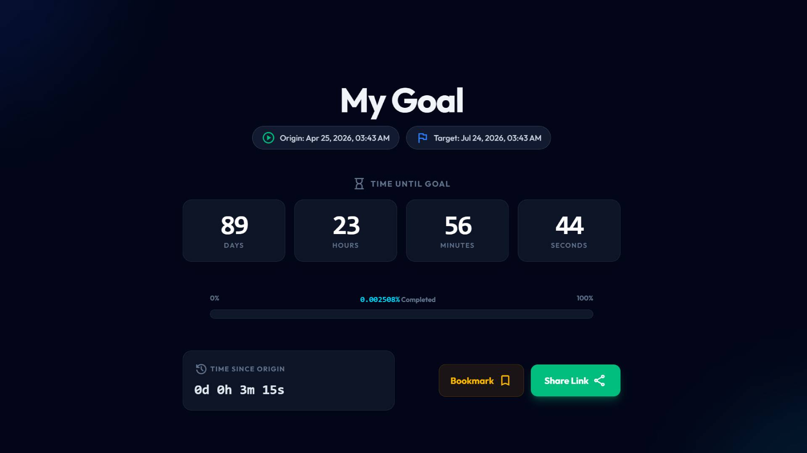

# ZeroHour

<div align="center">
  
</div>

ZeroHour is a React-based application for creating and sharing countdown timers. The application state is maintained entirely through URL parameters, allowing timers to be shared simply by copying the link without the need for a backend database.

## Features

- **URL-Based State**: Timer configurations (start date, target, and title) are encoded in the URL (`?title=...&start=...&targetType=...`), allowing for easy sharing without a backend.
- **Responsive UI**: Built with Tailwind CSS v4, supporting both Light and Dark modes. Theme preferences are saved in `localStorage`.
- **Progress Tracking**: Displays time elapsed, time remaining, and a high-precision progress bar.
- **Native Data Input**: Uses native browser interfaces for date and time selection to balance usability and mobile compatibility.

## Live Demo
Check out the project live at: [https://javchz.github.io/ZeroHour/](https://javchz.github.io/ZeroHour/)

## Tech Stack

- React + Vite
- Tailwind CSS v4
- `date-fns` for date manipulation
- Google Fonts & Material Symbols

## Local Setup

### Prerequisites
- Node.js
- npm

### Installation
1. Clone the repository:
   ```sh
   git clone https://github.com/JavChz/ZeroHour.git
   ```
2. Install dependencies:
   ```sh
   npm install
   ```
3. Start the development server:
   ```sh
   npm run dev
   ```

### Deployment
To deploy to GitHub Pages, use the provided npm script:
```sh
npm run deploy
```
This command builds the project into the `dist` directory and pushes it to the `gh-pages` branch.

## License
Distributed under the MIT License.
